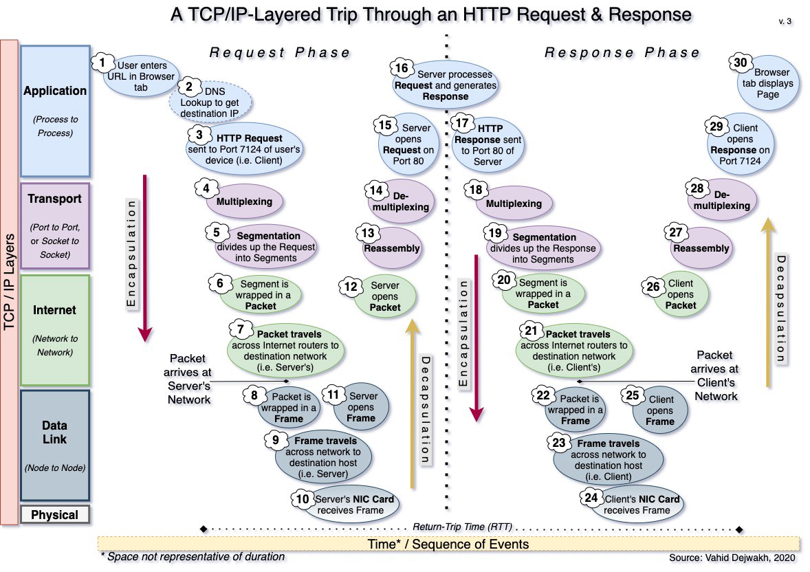

# http request/response cycle

## what is HTTP?

- "Hyper-**_text_** transfer protocol": a HTTP req/res exchange cycle involves the sending and receiving of text between a client and a server

- the protocol that governs data exchange on the Web

### use cases for GET and POST

- **`GET`**
  - used to _retrieve_ some resource _from_ a server
  - typically thought of as a "read-only" operation since `GET` doesn't involve the changing of values on a server
  - used when we click on a hyperlink

- **`POST`**
  - used to _send_ ~something~ _to_ a server
  - involves _**changing values stored on a server**_
  - usually involves sending some _sensitive data_ (such as submitting an ID or inputting credit card info)
  - initiating some server-side activity
  - _posting_ large files to a server (`POST` enables us to send significantly larger forms of info than does `GET` (???))

### http requests

  - consist of
    - 1. _method_: verbs (GET/POST) || nouns (OPTIONS/HEAD); specify the desired operation
    - 2. _path_: (`file/path/to/resource.html`)
    - 3. _version_: of protocol (`HTTP/1.1`)
    - 4. _headers_: optional; convey info re: request context so _server_ can tailor response
    - 5. _body_: raw data (html webpage, `js`, raw files like photos, videos, etc...)

### http responses

  - response consists of a _response line_, _headers,_ and a _body_

  - _response line_ contains the _status code_, _status text_, and _version_

  - HTTP response headers contain additional information about the response

    1. information about the type of encoding used to encrypt the data

    2. name of the server
    3. a new resource location if applicable (Location header), which helps the client redirect to the requested resource if it has been moved (`302`)'
    4. content-type (i.e. text/html); helps client render data in a user-friendly way

  - The HTTP response body consists of the raw data for the requested resource (HTML of the webpage, images, videos, or audio files)

## describe the HTTP request/response cycle

thanks vahid

## what are status codes?  different types?

- part of the status line in an HTTP response; indicate the status of the client's current request

- CLIENT REQ -> SERVER RES -> `404` -> status code displayed for client to see

| status | category | meaning |
| - | - | - |
| 1xx | informational | info |
| 2xx | success | "request successful"; resource transmitted; 2xx `=` big success! |
| 3xx | redirection | requested resource has moved; indicate redirect status; automatically (?) follows the supplied url listed by the `Location` header |
| 4xx | client error | "resource not found"; client-side error w/ request |
| 5xx | server error | internal server error; a generic server-side error |

## what is meant by 'state' in the context of the web?  how does HTTP simulate state?

- a "stateful" application is one which retains client data from the activities of a past session

- _"HTTP is stateless, but not sessionless"_

- _"HTTP is a stateless protocol; each cycle is independent of the one before and the one that came after"_
  - stateless protocols like `http` are _resilient_, _fast_, and _flexible_
  - `http` doesn't retain client data between individual response/request cycles so there's

- this information might pertain to the state of some aspect of the page (like the contents of their shopping cart) or the user's status of being "logged-in" to their account for the application

  - when the user adds an item to their cart they issue a new HTTP request

  - for this fictional application to do something useful, it needs to somehow retain it's current state post-new http request

  - while `http` is very much a _stateless protocol_; developers can _simulate_ statefulness, meaning that the application _feels like and appears_ to have a persistent connection to the resource, when in reality, it is simply the **_appearance of persistent state_**

    - achieved via session IDs, cookies, and AJAX

    - _cookies_ allow the use of stateful _sessions_
