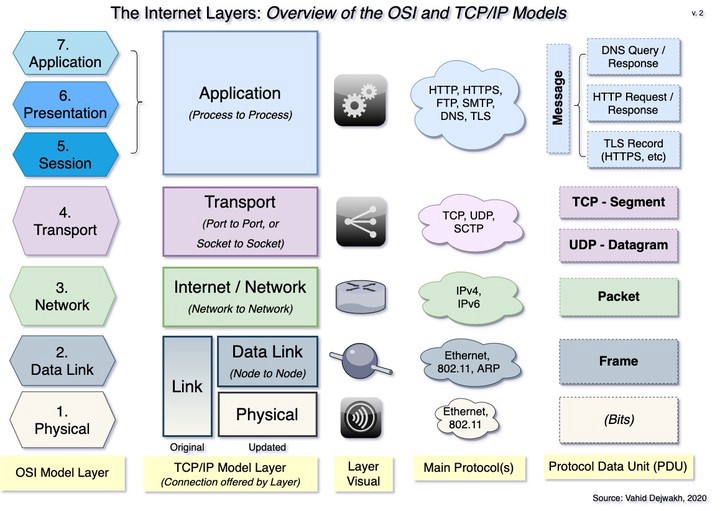

# internet layers 
## what is the [internet](./internet_layers.jpg)?  how does it work?

## characteristics of physical network

- concerned with transmitting signals (in the form of _bits_); over coaxial or fiberoptic cables, or a wireless medium

## how do lower level protocols operate?

## what is an IP address?  what is a port number?

## how does DNS work?

## client-server model of web interaction; role of HTTP within that model

