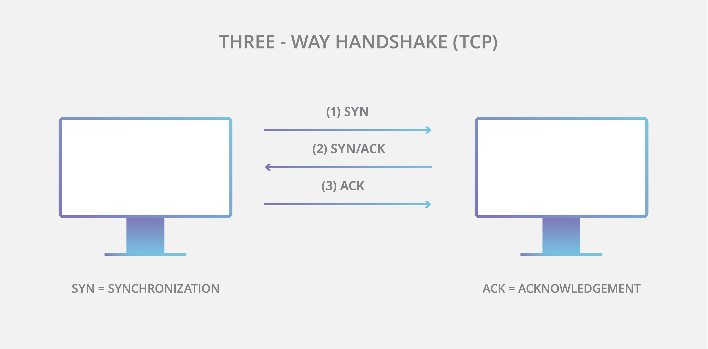
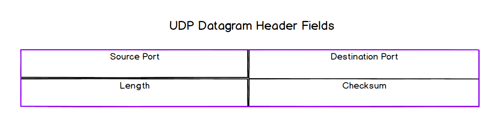

# tcp udp

## transport layer

  - concerned with providing end-to-end communication between *specific processes* (read: applications)

  - the SINGLE host-to-host connection provided at the internet/network layer (eg. IP) is used by multiple processes

  - this end-to-end communication is achieved thru [_multiplexing_](#multiplexing)

  - postal service analogy:

    - street address     == IP address
    - apartment number   == port number

    - Postal-service     == Internet Protocol (IP)
    - Building concierge == Transport layer (TCP or UDP)

## multiplexing

  - different apps want to be able to send&receive data simultaneously and thus require of the host device _distinct channels of communication_

  - multiplexing allows for multiple, different applications (e.g. spotify, chrome, & slack) being active on the same device (like my iPhone) thru a single network (IP) connection (host-to-host)

  - my iPhone has one IP address; however there's many thousands of ports available; _thus the use of ports alongside an IP address enables multiplexing_

  - the combo of IP address & port number effectively defines a *network socket* which is one communication endpoint

  - these various sockets facilitate internet protocol and transport layer protocols (like tcp/udp) to transmit data between multiple applications of different devices, all of which is enabled via multiplexing/demultiplexing

  - sockets enable end-to-end communication

    - conceptually: abstraction for an endpoint in inter-process (read: inter application) communications

    - implementation: internet sockets; a mechanism for inter-process communication between networked processes

  - "need to transmit data contained in _distinct channels_ over a single channel (essentially, send a packet (via IP) from source address to destination address) and then somehow separate them out at the other end."

## tcp

  - is a connection-oriented protocol (dedicated socket objects for indiv processes)
  - establishes a reliable connection using the [_three-way handshake_](#three-way-handshake) (+ complexity)

  - **Ginni summary**
    - Transmission Control Protocol is a protocol that operates within the Transport Later. It provides multiplexing, or end-to-end communication between multiple processes over the single channel provided by IP, via port numbers. It also has features that ensure reliability. It uses a three-way handshake to establish dedicated communication connections and this ensures data integrity, de-duplication, in-order delivery, and retransmission of lost data. The complexity of this process can cause significant latency overhead. To mitigate this and to be as efficient as possible, TCP provides flow control and congestion avoidance.

  - traits of the tcp PDU (_segment_)

    1. (De/)multiplexing
    2. error detection; data integrity (check sum field)
    3. in-order delivery, data-loss/data-duplication handling (sequence numbers & ack #)
    4. flow control (WINDOW SIZE field)
    5. congestion avoidance (WINDOW SIZE field)

    - most of these headers are there for reliability purposes
### PROS

  - _reliability_ (message acknowledgement & retransmission)
  - _in-order delivery_ of segments (via sequence numbers in segment header)

  - _flow control_
    - prevents sender from overwhelming receiver
    - max amount of data communicated thru WINDOW SIZE field in segment header
    - unprocessed data is stored in a buffer

  - _congestion avoidance_
    - if there's a lot of lost data occurring; tcp will reduce the size of the transmission window, thus reducing congestion and (hopefully) reducing the need to retransmit segments
    - tries to minimize duplicate transmission to improve efficiency

### CONS

  - performance! _tcp sacrifices speed for reliability_

  - latency overhead (mostly due to the initial [three-way handshake](#three-way-handshake)
  - since TCP implements in-order delivery, if a segment is lost, ensuing segments
  must wait their turn (queuing delay) thus adding more latency to the transfer;  known as _head-of-line blocking_

### three-way handshake

  - **purpose**: establishes dedicated and reliable connections between processes on different devices over the _inherently unreliable network infrastructure_

  - **STEPS**
    - **SYN**chronize: _sender asks receiver "ready to receive?"_ -> **SYN**
    - **ACK**nowledge: _receiver says, "message received"_ -> **SYN ACK**
    - **ACK**nowledge: _sender says, "message received"_   -> **ACK**

## udp

  - unlike tcp, udp doesn't take action to nullify the inherent unreliability of nether layers and overal network infrastructure

  - a _connectionless_ (read: intrinsically unreliable) protocol; simple pdu 

  - *datagram*

    - header has 4 fields

    - as the pdu has source/destination ports; thus provides (de)multiplexing

    - data payload consists of an encapsulated HTTP request or response (from application layer)

### PROS
  - the simplicity of UDP equates to high speeds & flexibility
  - is often used as a starting point from which to selectively add features
  - "one-way" traffic (sender -> receiver); no connection state info, ack, etc...
  - low latency, excellent for an app like Zoom

### CONS
  - no guarantee of message delivery
  - no guarantee of message delivery order
  - no built-in congestion avoidance or flow-control mechanisms
  - no connection state tracking, as it is a connectionless protocol

### similarities to tcp

  - both provide for multiplexing

  - since they exist at the same level (transport layer), both utilize the layer beneath (internet/network) and thus the header fields for source IP and destination IP address must be present in both respective protocol's PDU

  - data payload of both is an encapsulated HTTP request or response

