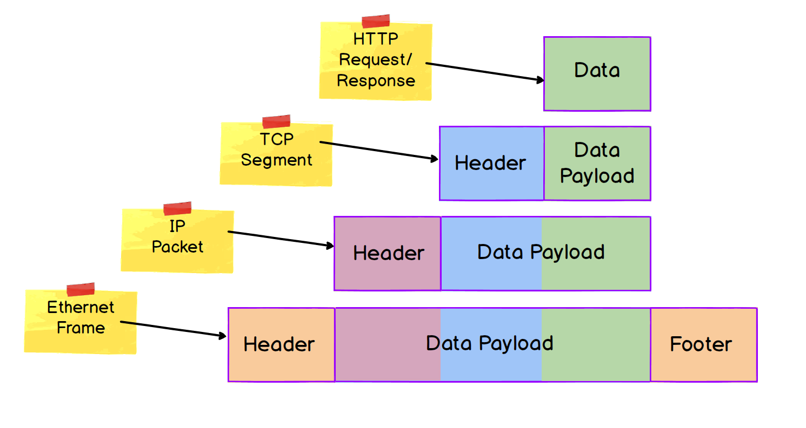

**network**
- a group of devices connected in such a way as they can exchange data and communicate with one another
- LAN (or WLAN; wireless) group of devices connected via network bridging device like a *switch*
- a LAN needs a way to communicate to other networks; enter the *router*
  - facilitates inter-network communication

**protocols**
- 'set of rules governing exchange & transmission of data'
- why so many protocols?
  - 1) to address diff. aspects of communication
    - *message structure* vs *flow and order*
  - 2) address same aspect in diff. way or a specific use-case
    - all concerned with *flow and order* of communication
    - TCP + UDP -> address same basic aspect of comm; in diff. ways
    - TCP + HTTP -> address diff aspect of communication
**a layered system**
- protocol groups function within varied layers of communication systems
  - logical message structure, logical message transfer, physical message creation/interpretation, physical message transfer
- communication systems are HIGHLY COMPLEX; by layering (or modularizing), we can more precisely zoom into specific layers to understand some aspect

- many models of the above modularization; two most popular are OSI and IPS
  - both roughly map to one another; but are different in their approaches
  - both have utility, but there is no one-size-fits-all model to fit real world implementation
  - FOR MY PURPOSES, these are just mental models to grasp higher-level ideas

**data encapsulation**
- similar to former concept of *encapsulation* in programming
- "in networking, we are *hiding data* from one layer by encapsulating it within a data unit of the layer below"
- Protocol Data Units (PDU): block of data transferred over network, @ diff layers they are called different names, sometimes referred to as a *frame* (Link/Data Link), *packet* (Internet/Network), *segment* (Transport), or *datagram* (Transport)
  - at all layers, the PDU consists of header, data payload, and (sometimes) a trailer/footer

  **header and tailer**
  - purpose: provide protocol-specific metadata about the PDU

  **data payload**
  - the data we want to transport over the network
  - the KEY to how the encapsulation is implemented
