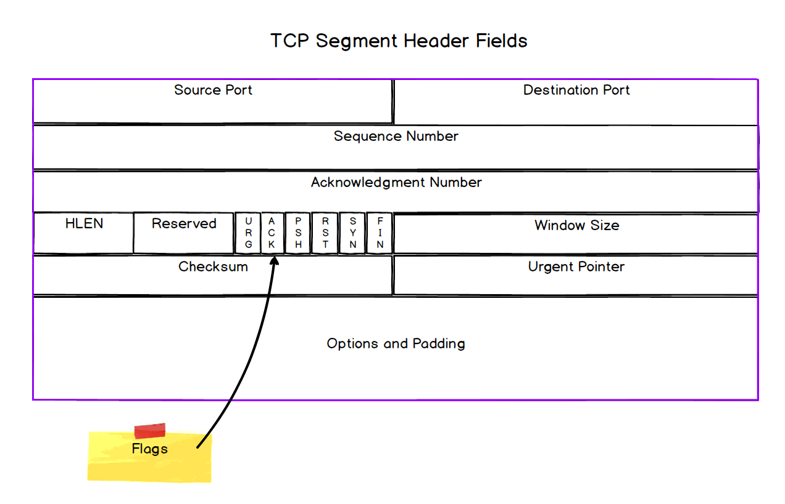

## **to focus on**

**how transport layer protocols enable communication between processes**
- Spend some time building a mental model for what multiplexing and demultiplexing are. Be clear about how ports work, along with IP addresses, to provide this functionality.
**network reliability is engineered**
- internet 'works' because of multiple technologies; reliability is one aspect of this
**understand tradeoffs**
- TCP and UDP (and the design decisions that produced each protocol) involve tradeoffs, know the main ones

## **communication between processes**
- IP's system of *addressing* enables communication between hosts (devices); the connection can be local or global, but it's only between the hosts, not the applications running on those hosts

**multiplexing & demultiplexing**
- MM of diff apps wanting to send&receive data simultaneously as being *distinct channels of communication* on a host
- IP packet header contains a single source and single destination
- "need to transmit data contained in *distinct channels* over a single channel (essentially, send a packet (via IP) from source address to destination address) and then somehow separate them out at the other end."
- **multiplexing**: transmitting multiple signals over a single channel
************************???****************************************
- **demultiplexing**: combining multiple, unrelated signals into a single signal
************************???****************************************

**ports**
- : *"an identifier for a specific process running on a host"*
  - like Spotify, Slack, etc...
- low ports (0-1023) are well-known ports (HTTP, FTP, SMTP)
- middle ports (1024-49151) are registered ports (IBM, Microsoft)
- high ports (49152-65535) are dynamic (temporary or *ephemeral*), not registered to private entities, not fixed

- we use ports to identify specific services running on a host
- source and destination port numbers (service identifiers, e.g. Spotify!) are part of the PDU for the transport layer, thus ports facilitate both multiplexing and demultiplexing as they are part of the segment header
- postal-service analogy: street address == IP address, apartment number == port number.  Postal-service == Internet Protocol, Building concierge == Transport layer (TCP or UDP)

**netstat**
- : a utility that returns a list of active network connections
- note that the various addresses (local/foreign) are a combination of IP address (`192.168.1.19`) & port number (`51475`)
  - the combination acts as a communication endpoint (socket) for transfer of data between applications running on host (device)

**sockets**
- combination of IP address and port number (ID) == socket; a communication end-point

- conceptually: abstraction for an endpoint in inter-process (app) communications
- implementation: internet sockets; a mechanism for inter-process communication between networked processes

**sockets and connections**
- connectionless vs connection-oriented systems
- connectionless: unconcerned with the "from whom?", time, order, etc...
- connection-oriented: cares about order (sequence numbers), acknowledgement (ACK flag), monitors state of connection, avoids congestion, controls flow. Essentially has more rules re: communication procedures (mainly in establish the connection (three-way handshake))
  - "four-tuple": source port, source IP, destination port, destination IP
  - checks to match these values in PDU

## **network reliability**
- the underlying network (eg: everything beneath the transport layer (Internet, data link, physical...)) is inherently unreliable; certain protocols attempt to establish reliability, others do not

**building a reliable protocol**
- "How do we ensure messages (data) have been successfully received?"
**v1**
- solution: sending an acknowledgement message upon recieving message
- issue(s): recipient never recieves, so no acknowledgement.  Acknowledgement is corrupted or lost in transit
**v2**
- solution: resend message if acknowledgement not recieved in certain time-frame
  - uses timeout and retransmission pattern to solve previous issue, however...
- issue: duplicate messages, how to know message is a duplicate or not?
**v3**
- solution: adding sequence of numbers to messages
- known as a STOP&WAIT protocol; functional but has tradoffs since we WAIT
- shores up areas, making transfer reliable, but...
  - INEFFICIENT USE OF AVAILABLE BANDWIDTH
**pipelining for performance**
- : sending multiple messages w/o WAITING for acknowledgements
- WATCH [SIMULATION](http://www.ccs-labs.org/teaching/rn/animations/gbn_sr/) VID?

## **transmission control protocol**
- "abstraction of reliable network communication on top of an unreliable channel"
- hides the complexity of all things network reliability related

**TCP segments**
-  is the PDU of TCP
  - most of the header fields of a segment relate to the implementation of reliable data transfer procedure
********************************

**TCP connections**
- connection established using the *three-way-handshake* (SYN and ACK flags)
- purpose of flags is mostly to manage *connection state* (most of the time this is either ESTABLISHED (client/host-side) or LISTEN (server-side))
**flow control**
- prevents sender from overwhelming receiver w too much data
- unprocessed data is stored ina a buffer (this 'size' of this buffer; e.g. how much memory is allocated depends on OS and physical resources present)
- amount of data one side of the connection is willing and able to accept is communicated to the other side via the WINDOW SIZE field
- does NOT prevent sender or receiver from overwhelming the underlying network...
**congestion avoidance**
- analogy: highway of cars; except instead of slow traffic, cars are lost
- various TCPs use different approaches + algorithms to determine WINDOWSIZE depending on network conditions; tries to minimize duplicate transmission as it is very inefficient
**disadvantages of TCP**
- high latency overhead by virtue of being connection-oriented (three-way handshake to establish)
- head of line blocking (general networking concept); adds to queuing-delays (buffers)
- also, if a segment is lost (thus needing to be retransmitted), because of TCP's requirement of "in-order" delivery, other segments that come after the lost segment must wait their turn in a queue, thus adding more delay/latency to the transfer

## **User Datagram Protocol (UDP)**
- PDU of UDP is a *datagram*
- header of datagram only has 4 fields (source port, destination port, length (in bits), checksum)
- doesn't take any actions to attempt to resolve inherent unreliability of lower layers (Internet, data link, physical)
- CONS compared to TCP...
  - no guarantee of message delivery
  - no guarantee of message delivery order
  - no built-in congestion avoidance or flow-control mechanisms
  - no connection state tracking, as it is a connectionless protocol

**the case for UDP**
- PROS compared to TCP...
  - simplicity == speed & flexibility
  - it's essentially one-way traffic (sender to receiver) (no acknowledgements/verifications/retransmissions, no connection state info)
- allows the developer to configure any necessary services that are lacking, they can elect to implement in-order delivery w/o retransmission..
- example: ZOOM; we don't care about a few lost bits, the low latency is well worth the trade off of video-quality

**Summary**
- Multiplexing and demultiplexing provide for the transmission of multiple signals over a single channel

- Multiplexing is enabled through the use of network ports

- Network sockets can be thought of as a combination of IP address and port number

- At the implementation level, sockets can also be socket objects

- The underlying network is inherently unreliable. If we want reliable data transport we need to implement a system of rules to enable it.

- TCP is a connection-oriented protocol. It establishes a connection using the Three-way-handshake

- TCP provides reliability through message acknowledgement and retransmission, and in-order delivery.

- TCP also provides Flow Control and Congestion Avoidance

- The main downsides of TCP are the latency overhead of establishing a connection, and the potential Head-of-line blocking as a result of in-order delivery.

- UDP is a very simple protocol compared to TCP. It provides multiplexing, but no reliability, no in-order delivery, and no congestion or flow control.

- UDP is connectionless, and so doesn't need to establish a connection before it starts sending data

- Although it is unreliable, the advantage of UDP is speed and flexibility
